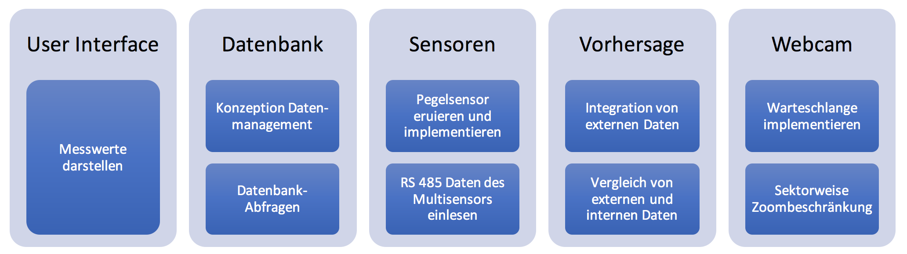

# Themenvorschlag BA
25.07.2017

User Interface und Datenmanagement für die Wetterstation Arbon

### Hintergrund
Die Wetterstation Arbon besteht aus einem Multisensor Wetter Transmitter (Vaisala VXT520), einer schwenkbaren Webcam und einem Messrohr mit Pegelmesser. Das Rohr ist zusätzlich mit PT100-Elementen ausgestattet um die Wassertemperatur messen zu können. Die Wetterstation und deren Webseite funktioniert zwar größtenteils, hat aber einige Schwachstellen:
* Die Sensordaten werden durch eine Flash-Applikation (Weather Display Live) dargestellt. Flash-Applikationen sind auf diversen Mobilgeräten und unterdessen auch Web-Browsern gesperrt.
* Weather Display Live bietet wenig Konfigurationsmöglichkeiten und die Übersetzung ins Deutsche ist fehlerhaft.
* Die Speicherung der Messwerte erfolgt in einer Datenbank beim Provider (Maria DB). Bisher gibt es keine Möglichkeit von der Webseite aus auf diese Daten zuzugreifen.
* Der Pegelmesser funktioniert nicht. Wahrscheinlich ist der Sensor defekt.

### Aufgabe
* Das User Interface soll nach den neusten Erkenntnissen in Informationsvisualisierung und Webtechnik neu aufgebaut werden. Dabei soll sowohl die Usability als auch die Barrierefreiheit eine zentrale Rolle spielen.
* Die Datenspeicherung und Datenverwaltung soll neu konzipiert werden. Der User soll über ein Webinterface selbständig Abfragen tätigen können. Die Werte sollen graphisch dargestellt werden und nach Bedarf auch heruntergeladen werden können.
* Für die Pegelmessung soll ein neuer Sensor eruiert und installiert werden. Damit können dann Pegel und Wellenhöhe bestimmt werden.
* Der Multisensor sendet seine Daten per RS 485. Die Daten sollen empfangen und direkt in die Datenbank gespeichert werden können.
* Im Internet gibt es diverse Quellen für Windprognosen. Diese sollen auf der Webseite integriert, und den effektiven Messwerten gegenübergestellt werden. Es soll ersichtlich sein, wie gut die Vorhersagen für den Ort der Wetterstation sind.
* Die Webcam soll mit einer Warteschlangenfunktion ausgerüstet werden. Zudem soll die Zoombeschränkung abhängig vom Blickwinkel sein.

*Abb.: Übersicht Module*
